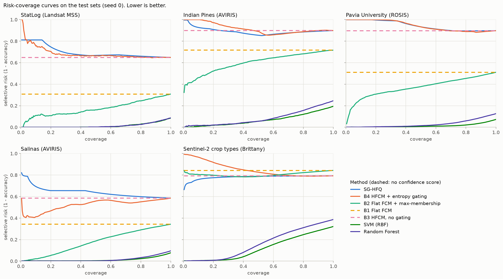

# Multi-dataset benchmark: SG-HFQ vs. the paper's E5 methods

This extends the StatLog study in [`README.md`](README.md) to the datasets the paper's
Sec. 6.2 names as future work: Indian Pines, Pavia University, Salinas, and a real-world
Sentinel-2 task. All seven methods of the paper's E5 protocol are evaluated with one protocol.

## Results

All numbers are test-set percentages, mean ± standard deviation over 5 seeds. **Bold** marks the best of
the seven main methods. B3, B4 and SG-HFQ share the same hierarchy and FCMs, so their fine predictions are
identical: they differ only in how they rank and gate samples, which is why their OA, AA and kappa
coincide. Full tables (macro F1, risk at 80% coverage, per-class accuracy, learned hierarchies) are in
[`results/benchmark/summary.md`](results/benchmark/summary.md), and raw per-seed values in
`results/benchmark/raw/`.

### Overall accuracy (OA, %)

| Method | StatLog | Indian Pines | Pavia University | Salinas | Sentinel-2 Brittany |
|---|---|---|---|---|---|
| B1 Flat FCM | 69.2 | 28.5 ± 1.0 | 49.5 ± 1.5 | 65.1 ± 0.8 | 17.7 ± 16.1 |
| B2 Flat FCM + max-membership | 69.2 | 28.5 ± 1.0 | 49.5 ± 1.5 | 65.1 ± 0.8 | 17.7 ± 16.1 |
| B3 HFCM, no gating | 35.1 | 13.5 ± 4.1 | 22.6 ± 11.3 | 37.7 ± 9.3 | 16.3 ± 3.9 |
| B4 HFCM + entropy gating | 35.1 | 13.5 ± 4.1 | 22.6 ± 11.3 | 37.7 ± 9.3 | 16.3 ± 3.9 |
| **SG-HFQ** | 35.1 | 13.5 ± 4.1 | 22.6 ± 11.3 | 37.7 ± 9.3 | 16.3 ± 3.9 |
| SVM (RBF) | **91.5 ± 0.1** | **80.0 ± 0.5** | **93.1 ± 0.3** | **92.4 ± 0.2** | **68.8 ± 1.2** |
| Random Forest | 91.2 ± 0.1 | 75.0 ± 1.3 | 87.5 ± 0.2 | 90.4 ± 0.1 | 61.6 ± 0.5 |
| *SG-HFQ (class-seeded)* | 56.7 | 28.5 ± 1.5 | 53.6 ± 1.4 | 67.3 ± 2.8 | 29.9 ± 0.2 |

### Average per-class accuracy (AA, %)

| Method | StatLog | Indian Pines | Pavia University | Salinas | Sentinel-2 Brittany |
|---|---|---|---|---|---|
| B1 / B2 Flat FCM | 68.5 | 36.5 ± 2.0 | 62.1 ± 1.2 | 74.7 ± 1.0 | 20.1 ± 4.6 |
| B3 / B4 / **SG-HFQ** | 33.2 | 9.4 ± 2.7 | 26.1 ± 3.6 | 37.4 ± 9.4 | 18.3 ± 4.3 |
| SVM (RBF) | **89.7 ± 0.1** | **70.4 ± 3.0** | **90.3 ± 0.5** | **95.7 ± 0.2** | **58.7 ± 0.5** |
| Random Forest | 89.2 ± 0.2 | 64.3 ± 1.9 | 83.2 ± 0.5 | 94.2 ± 0.2 | 54.6 ± 0.3 |
| *SG-HFQ (class-seeded)* | 60.5 | 34.3 ± 4.7 | 60.5 ± 0.9 | 71.1 ± 1.8 | 14.2 ± 0.2 |

### Cohen's kappa (x100)

| Method | StatLog | Indian Pines | Pavia University | Salinas | Sentinel-2 Brittany |
|---|---|---|---|---|---|
| B1 / B2 Flat FCM | 62.6 | 22.7 ± 1.0 | 39.6 ± 1.2 | 62.0 ± 0.9 | 10.0 ± 12.2 |
| B3 / B4 / **SG-HFQ** | 22.9 | 6.1 ± 1.6 | 13.0 ± 7.2 | 33.1 ± 9.6 | 4.7 ± 3.5 |
| SVM (RBF) | **89.5 ± 0.1** | **77.0 ± 0.5** | **90.8 ± 0.5** | **91.5 ± 0.2** | **61.3 ± 1.3** |
| Random Forest | 89.1 ± 0.2 | 71.1 ± 1.5 | 83.0 ± 0.3 | 89.3 ± 0.1 | 53.6 ± 0.6 |
| *SG-HFQ (class-seeded)* | 48.1 | 21.2 ± 1.2 | 43.2 ± 1.2 | 64.0 ± 2.9 | 4.5 ± 0.3 |

### Selective prediction: AURC (%, lower is better)

AURC is the paper's own headline metric. Each method ranks the test samples by its own confidence, and
the curve averages the error of the accepted samples over all coverages.

| Method | StatLog | Indian Pines | Pavia University | Salinas | Sentinel-2 Brittany |
|---|---|---|---|---|---|
| B1 Flat FCM (no score) | 30.9 | 71.5 ± 1.0 | 50.5 ± 1.5 | 34.9 ± 0.8 | 82.3 ± 16.1 |
| B2 Flat FCM + max-membership | 17.3 | 62.5 ± 2.9 | 39.6 ± 1.6 | 18.2 ± 0.9 | 73.6 ± 27.1 |
| B3 HFCM, no gating (no score) | 64.9 | 86.5 ± 4.1 | 77.4 ± 11.3 | 62.3 ± 9.3 | 83.7 ± 3.9 |
| B4 HFCM + entropy gating | 68.5 | 88.1 ± 4.8 | 85.1 ± 8.3 | 58.0 ± 15.2 | 88.8 ± 4.2 |
| **SG-HFQ** | 69.8 | 84.5 ± 6.8 | 85.8 ± 7.9 | 64.8 ± 11.5 | 84.7 ± 6.6 |
| SVM (RBF) | **1.4 ± 0.0** | **7.0 ± 0.3** | **1.2 ± 0.1** | **1.3 ± 0.1** | **12.0 ± 0.7** |
| Random Forest | 1.4 ± 0.0 | 9.2 ± 0.6 | 3.0 ± 0.1 | 1.6 ± 0.0 | 16.6 ± 0.4 |
| *SG-HFQ (class-seeded)* | 34.4 | 63.7 ± 6.2 | 40.3 ± 1.5 | 24.2 ± 2.2 | 65.5 ± 0.3 |

### SG-HFQ operating point (Q_threshold = 2): what the gate delivers

| Dataset | Fine coverage | Selective risk (fine labels) | Hierarchical accuracy (all outputs) | Abstained at root |
|---|---|---|---|---|
| StatLog | 65.5 | 67.3 | 55.0 | 21.4 |
| Indian Pines | 51.6 | 82.1 | 39.9 | 18.8 |
| Pavia University | 63.6 | 79.4 | 48.9 | 20.7 |
| Salinas | 42.5 | 64.0 | 64.5 | 19.9 |
| Sentinel-2 Brittany | 53.5 | 85.0 | 48.8 | 28.3 |

The class-seeded variant reaches 24-60% selective risk and 68-88% hierarchical accuracy at 17-44%
fine coverage. The operating points of every gated method are in `summary.md`.

### Average rank over the five datasets (1 = best)

| Method | OA | AA | kappa | AURC |
|---|---|---|---|---|
| SVM (RBF) | **1.0** | **1.0** | **1.0** | **1.0** |
| Random Forest | 2.0 | 2.0 | 2.0 | 2.0 |
| B1 / B2 Flat FCM | 3.5 | 3.5 | 3.5 | 4.0 / 3.0 |
| B3 HFCM, no gating | 6.0 | 6.0 | 6.0 | 5.4 |
| B4 HFCM + entropy gating | 6.0 | 6.0 | 6.0 | 6.2 |
| SG-HFQ | 6.0 | 6.0 | 6.0 | 6.4 |



### Findings

1. **The supervised references win on every dataset and every metric.** The SVM is first everywhere and
   the Random Forest second. Their accuracies sit in the range usually reported for these split ratios
   (SVM: Indian Pines 80.0%, Pavia University 93.1%, Salinas 92.4%), which supports the protocol and the
   data handling.
2. **SG-HFQ ranks last on every dataset.** Its full-coverage accuracy (13.5-37.7% on the hyperspectral
   and Sentinel-2 sets) is below plain flat FCM everywhere. The cause is the one found on StatLog:
   each node's FCM drifts away from the child groups it was seeded with. With 9-16 classes the trees
   are 5-8 levels deep, so routing errors compound and whole classes are almost never recognised. Asphalt,
   Gravel and Bitumen on Pavia score 0%, and Fallow_smooth and Corn_senesced on Salinas 0.1-0.2%. Because the learned tree
   and its partitions change with the training sample, accuracy also varies strongly across seeds
   (± 4-11 points).
3. **Gating does not rescue it.** At its operating point SG-HFQ still mislabels 64-85% of the samples it
   labels finely. Its AURC is worse than flat FCM + max-membership (B2) on all five datasets and 63-85
   points worse than the SVM. The paper's expected outcome (SG-HFQ beats B2 on AURC) is not reproduced
   on any dataset.
4. **Per-node quantisation gives no consistent gain over raw entropy.** SG-HFQ beats B4 on AURC on
   Indian Pines and Sentinel-2. B4 is better on Salinas, and the two are close on StatLog and Pavia.
5. **The fuzzy methods' weakness is not the 10-component representation.** The same SVM and RF on the
   identical Phase 1 features keep 56-91% OA. The reduction costs them 1-11 points (most on
   Sentinel-2), far less than the gap to SG-HFQ.
6. **Class-centroid seeding (E2 option B) is the most useful change.** It roughly doubles SG-HFQ's
   accuracy on the hyperspectral sets and makes the coarse labels reliable (hierarchical accuracy
   68-88%). It matches or exceeds flat FCM in OA on four of the five datasets (StatLog is the exception), but
   stays far below the supervised methods.
7. **Sentinel-2 is the hardest, most realistic task for every method.** Test parcels come from an
   unseen department and keep their true class balance. Training uses a class-capped sample, so its
   priors differ from the test priors. The SVM reaches 68.8% OA (kappa 0.61). Its main errors are
   permanent vs. temporary meadows (31.8% and 58.1% per-class accuracy), the known hard pair in
   BreizhCrops. Sunflower (2 test parcels) and nuts (11) are never recognised by any method.

### Caveats

- The hyperspectral numbers use random pixel splits. Neighbouring pixels in train and test make these
  scores optimistic for all methods, and especially for the supervised ones. The Sentinel-2 experiment
  avoids this with a department-level split.
- No deep-learning or spatial-spectral baselines are included; the comparison is restricted to the
  paper's E5 methods. Their uncertainty-aware counterparts (MC dropout, Bayesian CNNs) are listed as
  future work in the paper itself.
- The 10-component PCA, the split fractions and the Sentinel-2 class caps were fixed a priori and not
  tuned. Other choices would move the numbers, but they would not close a 50-point gap.

## Methods

| # | Method | What it is |
|---|---|---|
| 1 | **B1 Flat FCM** | One FCM cluster per class, seeded at the training class centroids; clusters labelled by Hungarian matching. No confidence score |
| 2 | **B2 Flat FCM + max-membership** | B1 predictions, ranked by the maximum membership |
| 3 | **B3 HFCM, no gating** | The SG-HFQ hierarchy and graph-seeded node FCMs, with arg-max routing to a leaf. No confidence score |
| 4 | **B4 HFCM + entropy gating** | B3, ranked by the raw minimum confidence (1 - normalised entropy) along the path. Gated with one global threshold (the pooled training quantile matching Q_threshold) |
| 5 | **SG-HFQ** | The paper's method (Phases 1-7): JM + Wasserstein ambiguity graph, average-linkage hierarchy, graph-seeded FCM per node, per-node quantile grades (L = 5), gate Q >= 2 |
| 6 | **SVM (RBF)** | libsvm C-SVC, one-vs-one, Platt probabilities; selection score = maximum probability |
| 7 | **Random Forest** | 500 trees; selection score = maximum class probability |
| s | SG-HFQ (class-seeded) | Supplementary: E2 option B (one FCM cluster per class at each node) |
| s | SVM / RF, Phase 1 features | Supplementary: the supervised references on the same reduced features as the fuzzy methods |

## Protocol

- **Phase 1 representation (fuzzy methods 1-5).**
  - StatLog uses the paper's band-mean 4-D features.
  - The other datasets z-score every band with training statistics, then project onto the first
    10 principal axes of the training data (unwhitened). This is the high-dimensional analogue of the band
    mean: it avoids the near-singular class covariances the paper warns about for high-D data.
- **Class covariances for JM.** StatLog uses the sample covariance, as in the original study. The other
  datasets use Ledoit-Wolf shrinkage, because some classes have only 5-7 training samples
  (e.g. Oats, Alfalfa, sunflower).
- **Supervised references (6-7).** All bands, z-scored. SVM C ∈ {1, 10, 100, 1000} and
  γ ∈ {1e-4, 1e-3, 1e-2, 0.1, 1} are chosen on the validation split; StatLog has no validation split, so
  5-fold CV on its official training set is used instead. RF hyper-parameters are fixed.
- **Fixed a priori, never tuned on test data.** L = 5, Q_threshold = 2, alpha = 0.5, m = 2, average linkage,
  10 principal components, the split fractions and the Sentinel-2 caps.
- **Repeats.** 5 seeds. For the hyperspectral and Sentinel-2 datasets each seed draws a new split; StatLog
  keeps its official split, so only the SVM/RF randomness changes.
- **Metrics (test set).**
  - Overall accuracy (OA), average per-class accuracy (AA), Cohen's kappa, macro F1.
  - AURC, the area under the risk-coverage curve of each method's own confidence ranking, with tied
    scores credited at their expected risk.
  - For the gated methods, the operating point: fine coverage, selective risk, hierarchical accuracy and
    root abstention.

## Datasets

| | StatLog | Indian Pines | Pavia University | Salinas | Sentinel-2 Brittany |
|---|---|---|---|---|---|
| Sensor | Landsat MSS | AVIRIS | ROSIS | AVIRIS | Sentinel-2 MSI (L2A) |
| Scene | 82 x 100 px tiles, 3x3 neighbourhoods | 145 x 145 px, 20 m | 610 x 340 px, 1.3 m | 512 x 217 px, 3.7 m | 4 French departments, field parcels |
| Bands / features | 4 bands x 9 pixels = 36 | 200 (224 minus water absorption) | 103 | 204 (224 minus water absorption) | 10 bands x 6 bi-monthly composites = 60 |
| Classes | 6 | 16 | 9 | 16 | 9 crop types |
| Labelled samples | 6,435 | 10,249 | 42,776 | 54,129 | 608,489 parcels |
| Train / val / test (seed 0) | 4,435 / - / 2,000 (official) | 1,030 / 517 / 8,702 | 2,137 / 2,137 / 38,502 | 2,706 / 2,706 / 48,717 | 3,535 / 1,420 / 122,708 |
| Split | official UCI split | 10% / 5% / rest per class (min 5 / 3) | 5% / 5% / rest per class | 5% / 5% / rest per class | spatial: by department |

The hyperspectral splits are the usual random per-class pixel samples. Because training and test pixels
are spatial neighbours, this split is known to favour supervised classifiers. It is kept here because
it is the protocol most published numbers use. The Sentinel-2 task uses a spatially disjoint split instead.

### Sentinel-2 real-world experiment: crop-type mapping in Brittany, France

The task is to map the crop grown on every declared agricultural parcel in Brittany for the 2017
season, using only Sentinel-2. It is validated on a department that is never seen in training. This is
the setting of an operational Common Agricultural Policy (CAP) monitoring system.

**Why crop types rather than soil types.** Agricultural soil-type prediction was the preferred task, but
it needs field-surveyed soil labels (e.g. LUCAS topsoil), and none could be reached from this environment
(ESDAC/JRC and Zenodo hosts were blocked). The fallback is the task the request also allows:
agricultural land-cover (crop-type) classification with official ground truth.

| Item | Details |
|---|---|
| Geographic region | Brittany (Bretagne), north-west France, about 27,200 km². The four departments (NUTS-3) are Côtes-d'Armor (FRH01), Finistère (FRH02), Ille-et-Vilaine (FRH03) and Morbihan (FRH04) |
| Data source | BreizhCrops (Rußwurm et al., 2020, *ISPRS Archives* XLIII-B2): parcel-averaged Sentinel-2 Level-2A surface reflectance, from the public bucket `breizhcrops.s3.eu-central-1.amazonaws.com` |
| Sentinel-2 bands used | B2 (490 nm), B3 (560 nm), B4 (665 nm), B8 (842 nm) at 10 m; B5 (705 nm), B6 (740 nm), B7 (783 nm), B8A (865 nm), B11 (1610 nm), B12 (2190 nm) at 20 m. The 60 m atmospheric bands B1, B9 and B10 are not used |
| Spatial resolution | 10 m / 20 m pixels, averaged over each field parcel (object-based); the sample unit is the parcel |
| Acquisition period | 2 January to 28 December 2017. About 58-71 distinct acquisition dates per department; median 27-39 observations per parcel, of which a median of 28 are clear |
| Ground-truth source | French Land Parcel Identification System, the *Registre Parcellaire Graphique* (RPG) 2017: farmers' crop declarations for CAP subsidies, published by IGN/ASP under an open licence, grouped by BreizhCrops into 9 classes |
| Classes | barley, wheat, rapeseed, corn, sunflower, orchards, nuts, permanent meadows, temporary meadows |
| Number of samples | 608,489 parcels: FRH01 178,632; FRH02 140,782; FRH03 166,367; FRH04 122,708. No parcel was dropped for lack of a clear observation |
| Preprocessing | (1) Clear-sky screening: keep an observation if B2 < 0.15 reflectance and its edge and saturation flags are 0. The provided cloud flag marks about 57% of spectrally clear observations as cloudy, so it is not used. (2) Bi-monthly median composites of each band (Jan-Feb ... Nov-Dec). (3) Linear interpolation across empty periods. (4) z-scoring with training statistics, plus 10 principal components for the fuzzy methods. Script: `scripts/build_sentinel2_breizhcrops.py` |
| Train / validation / test | Spatially disjoint by department, following the BreizhCrops convention. Train: up to 500 parcels per class from FRH01 + FRH02 (3,535). Validation: up to 200 per class from FRH03 (1,420). Test: **all 122,708 parcels of FRH04**, with their real class distribution. Train and validation are redrawn for each of the 5 seeds |

Class distribution (parcels):

| Class | FRH01 | FRH02 | FRH03 | FRH04 (test) |
|---|---:|---:|---:|---:|
| barley | 13,051 | 10,736 | 7,154 | 5,981 |
| wheat | 30,380 | 15,026 | 27,202 | 17,009 |
| rapeseed | 5,596 | 2,349 | 3,557 | 3,244 |
| corn | 44,003 | 36,620 | 42,011 | 31,361 |
| sunflower | 1 | 6 | 10 | 2 |
| orchards | 937 | 348 | 1,217 | 552 |
| nuts | 10 | 18 | 10 | 11 |
| permanent meadows | 32,641 | 36,536 | 32,524 | 26,134 |
| temporary meadows | 52,013 | 39,143 | 52,682 | 38,414 |

Sunflower (2 test parcels) and nuts (11) are so rare that their per-class accuracy is very noisy, and
this pulls AA down for every method. They are kept, because dropping rare classes would no longer be the
real-world task.

## Reproduce

```bash
pip install -r requirements.txt h5py
python scripts/fetch_hsi.py                                     # Indian Pines, Pavia U, Salinas (~68 MB)
python scripts/build_sentinel2_breizhcrops.py --cache /tmp/bc   # Sentinel-2 Brittany (~3.5 GB download)
python -m sg_hfq.benchmark run --datasets all --seeds 5         # ~40 min sequentially on 4 cores
python -m sg_hfq.benchmark report                               # tables + figure
```

The raw per-seed results, per-class accuracies and tables are in `results/benchmark/`.
