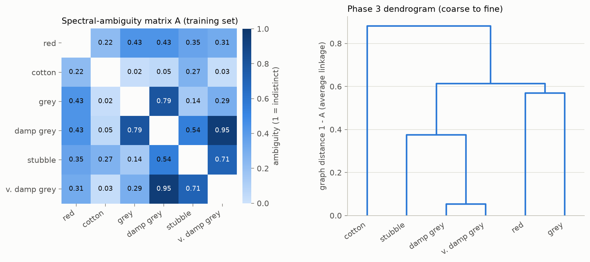
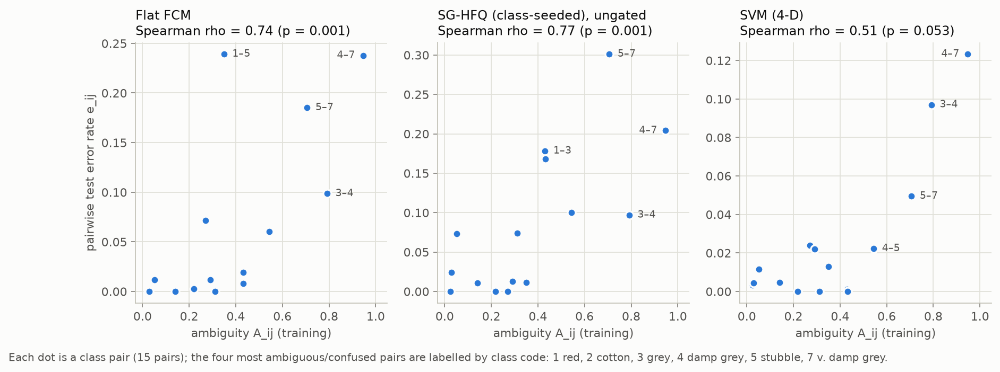
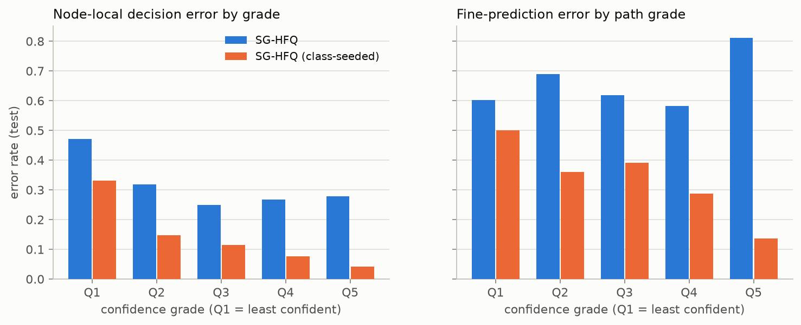
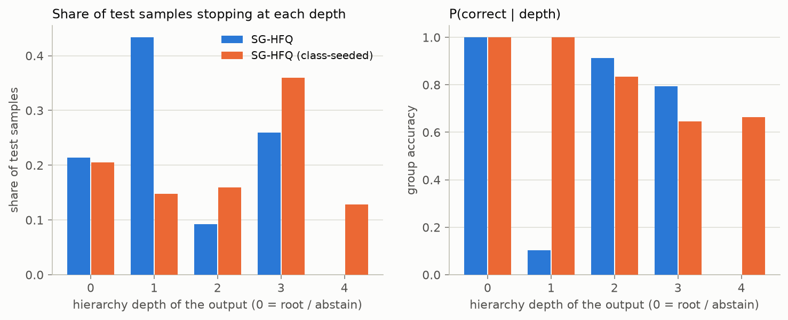
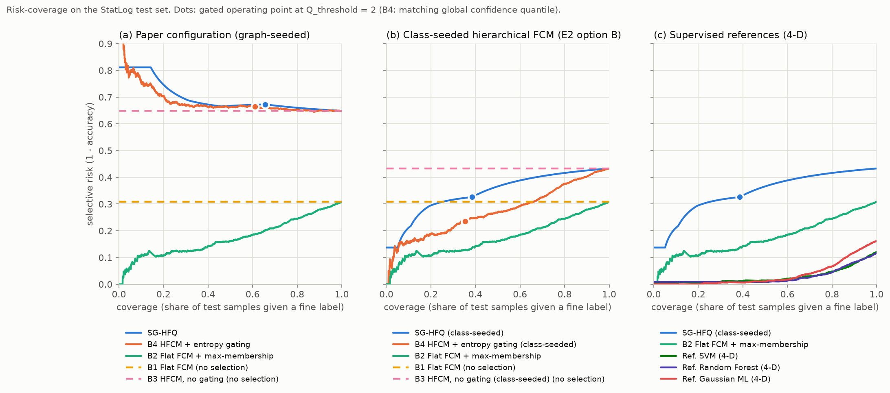

# SG-HFQ on StatLog Landsat: implementation and reproduction

This repository implements **Spectral-Graph-Guided Hierarchical Fuzzy Quantization (SG-HFQ)**
(Sowkarthika B., *"Spectral-Graph-Guided Hierarchical Fuzzy Quantization for Reliable and
Interpretable Soil and Land-Cover Classification from Remotely Sensed Data"*, submitted to IEEE
TGRS). It runs the paper's experimental protocol (E1-E6) on the same dataset and split:
StatLog (Landsat Satellite), 4,435 training and 2,000 test samples.

The paper's Results section is a placeholder. The numbers below are produced by this code.
Every table and figure is regenerated by one command, deterministically, in about 50 seconds.

```bash
pip install -r requirements.txt          # or: pip install -e ".[dev]"
python -m pytest                         # 38 unit tests
python -m sg_hfq.experiments --out results
```

## Headline findings

| Expected outcome (paper, Sec. 5) | Observed | Evidence |
|---|---|---|
| A_ij correlates with observed pairwise error rate | **Reproduced**. Spearman rho = 0.74 (flat FCM), 0.69 (Gaussian ML), 0.55 (RF), 0.51 (SVM). The JM term alone correlates more strongly (0.79-0.94) | E1 |
| Error decreases monotonically across confidence grades | **Not with the paper's FCM seeding** (node-local error 0.47, 0.32, 0.25, 0.27, 0.28). **Yes with class-centroid seeding** (0.33 to 0.04, strictly monotone) | E3 |
| SG-HFQ achieves lower risk at moderate-to-high coverage | **Not reproduced** | E5 |
| SG-HFQ AURC beats flat FCM + max-membership | **Not reproduced**. AURC 0.698 vs 0.173. The best variant (class-seeded) still scores 0.344, worse by +0.171 [95% CI 0.149, 0.194] | E5 |

**The main reason is Phase 4.** At each node the paper runs FCM with one cluster per child group,
seeded at the group centroids. FCM then moves the centres to wherever its own objective is
minimised. At the root, the child groups are `{cotton}` (479 samples) and the multi-modal
`{red, grey, damp grey, stubble, v. damp grey}` (3,956 samples). The cotton centre migrates into
the dark, wet soils, and 1,037 of the 2,000 test pixels are routed to the cotton leaf. Under oracle
routing the root decision is 98.7% accurate using the seeds alone, but only 51.2% after FCM
converges.

E2 confirms that the seeds make no difference: graph-derived seeding and 10/10 random restarts
converge to the same optimum. Seeding one cluster per *class* (E2 option B) limits the drift and
restores accuracy (35% to 57%). It still does not beat flat FCM (69%) or flat FCM + max-membership.
All of this was checked against an independent FCM (`scikit-fuzzy`, memberships agree to within 4e-9)
and a brute-force router (no mismatches).

## Repository layout

```
sg_hfq/
  data.py           StatLog loader, official-split check, Phase 1 representation (band-mean 4-D, z-score)
  separability.py   Phase 2: Bhattacharyya/JM (Eqs. 2-3), band-wise Wasserstein (Eqs. 4-5), ambiguity A (Eqs. 6-7)
  hierarchy.py      Phase 3: agglomerative clustering of the ambiguity graph -> coarse-to-fine tree
  fcm.py            Fuzzy C-means with explicit seeding, objective J_m, Xie-Beni index
  quantization.py   Phase 5: fuzzy entropy, normalised entropy, confidence, quantile grades (Eq. 8)
  model.py          SGHFQ: Phase 4 node models, Phase 6 gated routing (Eq. 9), Phase 7 outputs
  baselines.py      B1/B2 flat FCM; supervised references (SVM, Random Forest, Gaussian ML)
  metrics.py        risk-coverage curves, AURC / E-AURC, bootstrap CIs, pairwise error rates
  experiments.py    E1-E6 + supplementary sweeps; writes results/
  plots.py          figures
scripts/fetch_data.py  re-download / verify the dataset
data/statlog/          sat.trn, sat.tst (see data/README.md)
results/               generated tables (CSV), figures, Phase 7 per-sample outputs, summary.md
tests/                 unit tests
```

## Using the model

```python
from sg_hfq import SGHFQ, load_statlog

d = load_statlog()                                   # official split, class counts verified
model = SGHFQ(n_grades=5, q_threshold=2).fit(d.X_train, d.y_train)
print(model.hierarchy_.describe())                  # Phase 3 tree
out = model.predict(d.X_test)                        # Phase 6 routing
df = out.to_frame(d.y_test)                          # Phase 7: class, depth, H, H_norm, C, Q, stop/descend
```

`SGHFQ(init="class")` selects the class-seeded variant. `hierarchy="semantic" | "euclidean" | <nested tuple>`
replaces the spectral hierarchy, and `predict(X, conf_threshold=t)` gives the raw-entropy gate (baseline B4).

## Paper to code

| Paper | Implementation |
|---|---|
| Eq. 1, band-mean 4-D | `SpectralRepresentation("bandmean4")`: mean of each band over the 3x3 window, then z-scored with training mean/std |
| Eqs. 2-3, JM | `bhattacharyya_gaussian`, `jeffries_matusita`: class Gaussians from training data, Sigma = (Sigma_i + Sigma_j)/2 |
| Eqs. 4-5, Wasserstein | `wasserstein_matrix`: `scipy.stats.wasserstein_distance` per band, averaged over the 4 bands |
| Eqs. 6-7, ambiguity | `ambiguity_matrix`: min-max over off-diagonal pairs, both distances inverted, alpha = 0.5 |
| Phase 3 | `spectral_hierarchy`: average-linkage agglomerative clustering on distance 1 - A; the binary dendrogram is the tree |
| Phase 4 | `SGHFQ._fit_node`: FCM (m = 2) on the node's training samples, seeded at the child-group centroids, run to convergence (max centre shift < 1e-6, at most 1000 iterations). Clusters are labelled by Hungarian matching against the training groups (always the identity for seeded runs). Xie-Beni is recorded per node |
| Phase 5, Eq. 8 | `QuantileQuantizer`: per-node thresholds q_l = quantile(C_train at that node, l/L), L = 5 |
| Phase 6, Eq. 9 | `route`: descend to the arg-max child iff Q >= Q_threshold (= 2), else stop and output the current node's class group |
| Phase 7 | `RoutingResult.to_frame`, written to `results/predictions/phase7_test_outputs_*.csv` |

### Choices the paper leaves open

These were all fixed before looking at test results.

1. **Ambiguity fusion.** Eq. 6 writes the inversion only for JM. Blending an inverted JM with a
   non-inverted W would mix a similarity with a distance and contradict "high A_ij indicates
   ambiguity", so W is inverted too.
2. **Hierarchy.** Average linkage on the complete graph. The tree is the binary dendrogram:
   `(((1,3),((4,7),5)),2)`, i.e. cotton splits first, then {red, grey} vs {damp grey, v. damp grey,
   stubble}. Complete and weighted linkage give the same tree (S3).
3. **FCM data and inference.** Each node's FCM is fitted on the training samples whose true class
   lies under that node. At inference the frozen centres give memberships, so no training data is
   needed at inference, as the paper requires.
4. **Grades.** Quantile thresholds are computed per node, because the confidence distributions
   differ by node. L = 5 and Q_threshold = 2 (stop when a decision falls in the bottom training
   quintile at that node). The full threshold and L sweeps are reported.
5. **Stopping.** A sample that fails the gate at node v is labelled with v's class group. Stopping
   at the root is full abstention. A coarse output counts as correct if it contains the true class.
6. **Risk-coverage (E5).** Coverage is the share of test samples given a *fine* label, and risk is
   their error. Sweeping Q_threshold accepts exactly the samples whose minimum grade along the
   arg-max path is >= Q_threshold, so that minimum is SG-HFQ's selection score. Tied scores are
   credited with their expected risk under random ordering, so discrete grades are neither helped
   nor hurt by an arbitrary order. A continuous version (per-node empirical CDF, L -> infinity) is
   also reported.
7. **Baselines.** B1 = flat FCM (6 clusters seeded at class centroids, no selection). B2 = B1 ranked
   by max membership. B3 = the same hierarchy and FCM as SG-HFQ, no gating. B4 = B3 ranked and
   gated by *raw* path-minimum confidence, with one global threshold (the pooled training quantile
   matching Q_threshold). The "HFCM" (no graph) ablation row uses a hand-crafted semantic hierarchy
   `((2,5),(1,(3,4,7)))`, which the paper's Sec. 2.2 argues against. A Euclidean class-centroid
   hierarchy is reported as well.
8. **E2 options.** (A) random: K random training samples, 10 restarts. (B) class-centroid: one
   cluster per class in the node, seeded at the class centroids, memberships summed per child
   group. (C) graph-derived: the paper's Phase 4.
9. **Supervised references.** RBF-SVM with C and gamma from 5-fold CV and libsvm Platt
   probabilities; Random Forest with 500 trees; Gaussian maximum likelihood (QDA, the classic
   remote-sensing classifier). The score is the maximum class probability. They are run on both
   the 4-D and the 36-D representations.

## Results

Full tables are in [`results/summary.md`](results/summary.md) (CSV copies in `results/tables/`).
The test set has 2,000 samples, and all intervals are 95% percentile bootstrap intervals over
test samples (1,000 resamples).

### Phases 2-3: ambiguity graph and hierarchy



The most ambiguous pairs are damp grey / very damp grey (A = 0.95), grey / damp grey (0.79) and
stubble / very damp grey (0.71). Cotton is spectrally distinct from every class, so it is split
off first.

### E1: spectral-graph validation



| Similarity | Flat FCM | SVM (4-D) | RF (4-D) | Gaussian ML (4-D) |
|---|---|---|---|---|
| A (alpha = 0.5) | 0.74 (p = 0.002) | 0.51 (p = 0.053) | 0.55 (p = 0.033) | 0.69 (p = 0.005) |
| inverted JM only | 0.79 | 0.94 | 0.90 | 0.91 |
| inverted W only | 0.65 | 0.30 | 0.38 | 0.52 |

Spearman rho over the 15 class pairs, with A computed on training data and errors on test data.
The graph does track confusability. The Wasserstein term weakens the correlation for the
supervised classifiers, and alpha = 0.75 or 1.0 tracks errors better than 0.5
(`e1_alpha_sweep.csv`). The paper's own (ungated) SG-HFQ is the exception, at rho = -0.47: its
errors come from FCM drift, not from spectral overlap.

### E2: FCM initialisation

| Seeding | Test accuracy (ungated) | AURC | 5-fold CV accuracy (train) | Converged to the graph-seeded optimum |
|---|---|---|---|---|
| (A) random, 10 runs | 0.352 +/- 0.000 | 0.698 | 0.364 +/- 0.007 | 10 / 10 |
| (B) class-centroid | **0.567** | **0.344** | **0.608 +/- 0.033** | n/a |
| (C) graph-derived (paper) | 0.352 | 0.698 | 0.364 +/- 0.007 | n/a |

Graph-derived seeding gives exactly what random seeding gives. The partition is fixed by the FCM
objective, not by the seeds. The cross-validation on the training split shows the same ordering,
so preferring option B does not depend on the test set.

### E3: quantization calibration



| Error per grade | Q1 | Q2 | Q3 | Q4 | Q5 | Monotone? |
|---|---|---|---|---|---|---|
| Paper SG-HFQ, node-local | 0.472 | 0.318 | 0.249 | 0.267 | 0.278 | no |
| Paper SG-HFQ, path | 0.602 | 0.690 | 0.618 | 0.583 | 0.811 | no |
| Class-seeded, node-local | 0.331 | 0.147 | 0.114 | 0.077 | 0.042 | **yes** |
| Class-seeded, path | 0.500 | 0.360 | 0.391 | 0.288 | 0.137 | almost (Spearman -0.9) |

"Node-local" means each node's decision, evaluated on the test samples whose true class lies
under that node. "Path" means fine accuracy against the minimum grade along the arg-max path.
With the paper's seeding, the most confident decisions are among the wrong ones: the drifted
cotton cluster is assigned confidently.

### E4: depth-driven accuracy (Q_threshold = 2)



The class-seeded variant behaves as the paper describes. 20.6% of test samples abstain at the
root, coarse outputs at depths 1-2 are 83-100% correct, and fine leaves at depths 3-4 are about
65% correct. With the paper's seeding, 43% of samples stop at depth 1, mostly at the cotton leaf,
with P(correct) = 0.10. Every Q_threshold is listed in `e4_threshold_sweep.csv`.

### E5: selective prediction (risk-coverage)



| Method | Acc. @100% | AURC [95% CI] | Risk @50% | Risk @80% |
|---|---|---|---|---|
| B1 Flat FCM | 0.692 | 0.309 [0.289, 0.328] | 0.309 | 0.309 |
| B2 Flat FCM + max-membership | 0.692 | **0.173** [0.153, 0.194] | **0.161** | **0.244** |
| B3 HFCM, no gating | 0.352 | 0.649 [0.628, 0.669] | 0.649 | 0.649 |
| B4 HFCM + entropy gating | 0.352 | 0.686 [0.656, 0.712] | 0.662 | 0.653 |
| **SG-HFQ (paper)** | 0.352 | 0.698 [0.671, 0.724] | 0.667 | 0.660 |
| B3, class-seeded | 0.567 | 0.433 [0.411, 0.455] | 0.433 | 0.433 |
| B4, class-seeded | 0.567 | 0.272 [0.247, 0.298] | 0.269 | 0.376 |
| **SG-HFQ (class-seeded)** | 0.567 | 0.344 [0.317, 0.371] | 0.366 | 0.416 |
| Ref. SVM (4-D / 36-D) | 0.880 / 0.915 | 0.027 / 0.014 | 0.014 / 0.001 | 0.048 / 0.029 |
| Ref. Random Forest (4-D / 36-D) | 0.883 / 0.913 | 0.027 / 0.014 | 0.009 / 0.002 | 0.044 / 0.026 |
| Ref. Gaussian ML (4-D / 36-D) | 0.839 / 0.848 | 0.035 / 0.041 | 0.011 / 0.026 | 0.067 / 0.069 |

Paired bootstrap differences in AURC (positive means SG-HFQ is worse):

- Paper SG-HFQ vs B2: +0.525 [0.497, 0.551]
- Paper SG-HFQ vs B4: +0.012 [0.005, 0.020]
- Class-seeded vs B2: +0.171 [0.149, 0.194]
- Class-seeded vs its B4: +0.072 [0.063, 0.081]

At its Q_threshold = 2 operating point, class-seeded SG-HFQ labels 38.5% of pixels finely with
32.6% risk. B2 at the same coverage has 13.6% risk.

### E6: ablation

| Model | Graph | Hier. | Entropy | Quant. | Gate | Acc. (paper seeding) | AURC (paper seeding) | Acc. (class-seeded) | AURC (class-seeded) |
|---|---|---|---|---|---|---|---|---|---|
| Flat FCM | – | – | – | – | – | 0.692 | 0.309 | 0.692 | 0.309 |
| HFCM (semantic hierarchy) | – | ✓ | – | – | – | 0.326 | 0.674 | **0.682** | 0.319 |
| HFCM (Euclidean hierarchy) | – | ✓ | – | – | – | 0.327 | 0.673 | 0.634 | 0.367 |
| Graph-HFCM | ✓ | ✓ | – | – | – | 0.352 | 0.649 | 0.567 | 0.433 |
| + Entropy | ✓ | ✓ | ✓ | – | – | 0.352 | 0.686 | 0.567 | **0.272** |
| + Quantization | ✓ | ✓ | ✓ | ✓ | – | 0.352 | 0.698 | 0.567 | 0.344 |
| SG-HFQ (+ Gate) | ✓ | ✓ | ✓ | ✓ | ✓ | 0.352 | 0.698 | 0.567 | 0.344 |

Gate operating points (fine coverage, selective risk, hierarchical accuracy) are in
`e6_ablation.csv`. Three things stand out:

1. Adding the entropy score is the one component that clearly helps (class-seeded AURC 0.433 to
   0.272).
2. Per-node quantile grading *hurts* ranking (0.272 to 0.344). Re-normalising every node to its own
   quantiles and then taking the minimum along the path throws away how hard each node is, which
   the raw confidence keeps.
3. The gate leaves the ranking unchanged. What it adds is the coarse labels for rejected samples.

With class seeding, the spectral hierarchy is worse than the hand-crafted semantic one. Splitting
cotton off first and grouping {damp grey, v. damp grey, stubble} creates nodes where FCM still
drifts (the {4,5,7} node needs 429 iterations).

### Supplementary

- **S1, representation.** 36-D gives the same hierarchy as 4-D. Accuracy is 0.361 vs 0.352 (paper
  seeding) and 0.547 vs 0.567 (class-seeded). SVM and RF gain 3-4 points from 36-D;
  Gaussian ML gains about 1.
- **S2, number of grades.** L in {3, 4, 5, 8, 10} trades coverage against risk smoothly. No L
  makes SG-HFQ competitive with B2.
- **S3, linkage.** Average, complete and weighted linkage give the same tree. Single linkage gives
  `((1,((3,(4,7)),5)),2)`, which reaches 0.691 with class seeding but 0.234 with paper seeding.

## Reproducibility

- **Data.** The official UCI split is committed, and class counts are checked on every load. See
  [`data/README.md`](data/README.md) for provenance. `archive.ics.uci.edu` was unreachable from the
  build environment, so the files were rebuilt from the `mlbench` copy and verified.
- **Determinism.** All randomness is seeded (random FCM restarts, RF, SVM CV folds, bootstrap), and
  a second run reproduces every table byte-for-byte. Package versions and runtime are recorded in
  `results/config.json`.
- **Validation.**
  - FCM matches `scikit-fuzzy` (`tests/test_fcm.py::test_matches_scikit_fuzzy`).
  - The vectorised router matches a brute-force per-sample walk.
  - The Bhattacharyya distance matches its univariate closed form.
  - AURC handles ties by expectation.

## Citation

Paper: Sowkarthika B., "Spectral-Graph-Guided Hierarchical Fuzzy Quantization for Reliable and
Interpretable Soil and Land-Cover Classification from Remotely Sensed Data", submitted to IEEE
Transactions on Geoscience and Remote Sensing.
Data: A. Srinivasan, *Statlog (Landsat Satellite)*, UCI Machine Learning Repository, 1993,
<https://doi.org/10.24432/C55887> (CC BY 4.0).

Code: MIT License (see `LICENSE`).
